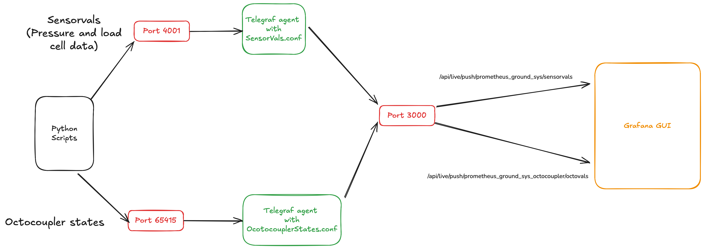

**Setup Instructions**

1. Install the following packages & verify that they have been installed
   1. Grafana | Verify installation using `grafana -v`
   2. Telegraf | Verify installation using `telegraf --version`
2. On Mac, start the grafana server using `brew services start grafana`
3. In separate **new terminal windows**, start the telegraf agents using the following commands
   1. Sensor readings: `telegraf --config Grafana_Files/OctocouplerStates.conf`
   2. Octocoupler: `telegraf --config Grafana_Files/OctocouplerStates.conf`
4. Run the python script to stream data to the telegraf server. The following commands correspond to the python scripts for the following tasks:
   1. (Task 1) Test with random data: `python Grafana_Files/Grafana_Test_RandomVals.py`
   2. (Task 2) Test with gaussian data: `python Grafana_Files/Grafana_With_Gaussian.py`
   3. (Task 2) Test with sinusoidal data: `python Grafana_Files/Grafana_With_Sinusoidal.py`
   4. (Task 3) Test with 10 data sensors: `python Grafana_Files/Grafana_With_Ten.py`
   5. (Bonus) Test with CSV files: `python Grafana_Files/Grafana_From_CSV.py`
